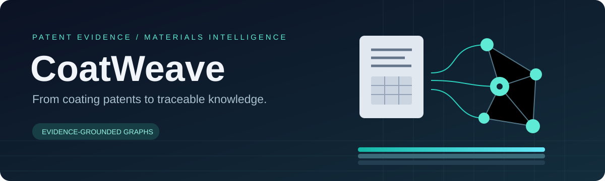
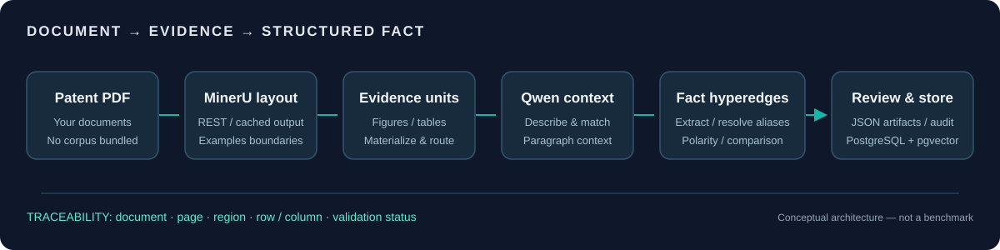

# CoatWeave

Evidence-grounded coating patent knowledge-graph research, created and maintained by [Nathan10969](https://github.com/Nathan10969).

中文简介：面向涂料专利的证据型知识图谱研究。本版公开历史源码，供阅读与追溯，不是完整可安装或可运行的发行包。

## Snapshot 02 — historical source archive

This release publishes timeline snapshot **02**, dated **2026-05-12 19:47:56 +08:00**, from development branch `feat/pipeline-stage0-2-gates` (source tip `e37372841b98dd1e16739eb737de8e810588c92d`). The publication commit uses its actual publication date; the source timestamp above is not a newly claimed development date.

The original ZIP contains 27 files, including 21 Python modules. Public branding, this README, the MIT license and original illustrations accompany the preserved source. Earlier public code remains available through [snapshot-01](https://github.com/Nathan10969/coat-weave/tree/snapshot-01); this version is available through [snapshot-02](https://github.com/Nathan10969/coat-weave/tree/snapshot-02).

## What the source contains

- Patent PDF layout and metadata extraction integrations.
- Figure/table evidence units, materialization and routing.
- Paragraph matching, proposed facts and canonical resolution.
- Typed evidence models and historical pipeline gate notes.

Read [the flow overview](PIPELINE_FLOW_OVERVIEW.md), [the historical quality audit](PIPELINE_QUALITY_AUDIT.md), [the flowchart](PIPELINE_FLOWCHART.html), [CLI source](cli.py) and [fact models](db/models.py). These development notes describe intended or implemented code paths, not independently verified production results.

The illustration is a conceptual project overview, not a claim that every stage or dependency is complete in this snapshot.

## Known limitations — intentionally not repaired here

This is an **incomplete historical source archive**, not a supported installation. The source ZIP has no `pyproject.toml`, dependency manifest or test suite. Package-relative imports and the historical Windows launcher do not provide a verified default launch from the `coat-weave` clone directory.

Required resources are absent: `prompts/fact_extract.txt`, `seed_canonical_starter.sql`, `seed_property_directionality.sql` and `seed_must_merge_starter.sql`. Reading the fact prompt fails with `FileNotFoundError` before any model call. Missing seed resources prevent a complete seeded canonical-resolution setup. Additional environment/dependency integration may be needed.

No business logic, package shim or missing resource was invented to make this archive look complete. Installation instructions and the previous snapshot's test results do not apply to this version.

## Publication checks and boundaries

- Frozen source ZIP size and SHA-256 verified against the local timeline.
- Python syntax parsing: all 21 source modules passed.
- Package-context module import and CLI help smoke passed in an existing isolated dependency environment; this is not a clean-install test.
- Gitleaks directory scan passed for this publication tree.
- README local links and retained SVG illustrations checked.

No ingestion acceptance, extraction accuracy, database migration, deployment or end-to-end run is claimed. No paid API calls, database writes or GPU experiments were performed. Raw PDFs, private corpora, API keys, pretrained models and generated runtime results are not included.

## License

[MIT](LICENSE) · Copyright © 2026 Nathan10969. Covers repository code and original illustrations, not third-party patents, datasets or service terms.
